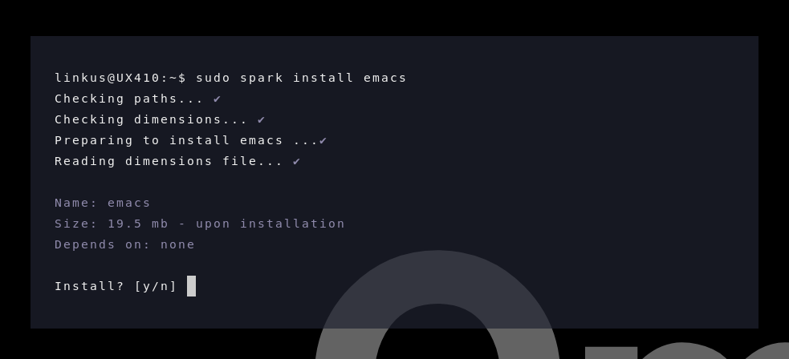
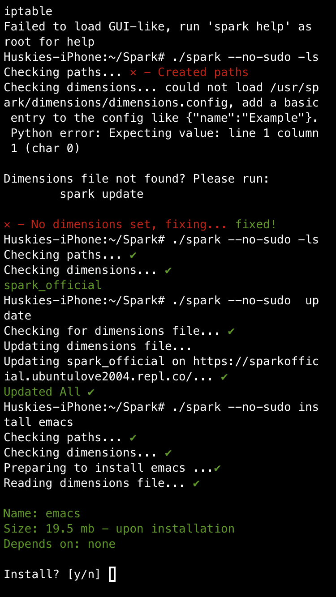

# Spark
Spark is a simple "build from source" package installer.
## Supported platforms
- Any linux distro*
- IPhone (ISH and native)
- WSL
* - ditro's that don't use `sudo` must have commands ran with the `--no-sudo` argument.
## Screenshots


## Installing
```
git clone https://github.com/HUSKI3/Spark.git
cd Spark
export PATH="$PWD:$PATH"
chmod a+x spark
```
## Setting up
```
(as root) spark -u
```

## Running
```
spark -h
or
(as root) spark -i nano 
```


## Spark Packages .spk
INFO: Still in-dev, so is the documentation for them. They will undergo revamps multiple times and should not be relied on untill they are fully developed

.spk is a tarfile with a fixed folder structure, meaning they wont contain any folders outsided the given specification

Folders to include are:
- deps - for the dependencies
- libs - for the libraries
- fs - (is being worked on) for fake root, not to be interfered by the user as of now
- bin - binary/s for the actual app

Files to include are:
- install.sh - install/build script for the package
- metadata.json - metadata

#### metadata.json (in a .spk package)
"package-data"[0] --> a list of info from the spark repo fpr the package
- "depends": in the package folder, deps/{dependency}
- might need to make a fetch thing to fetch the data for this list from the repo